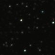
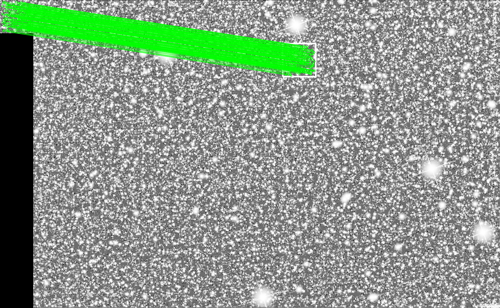
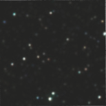
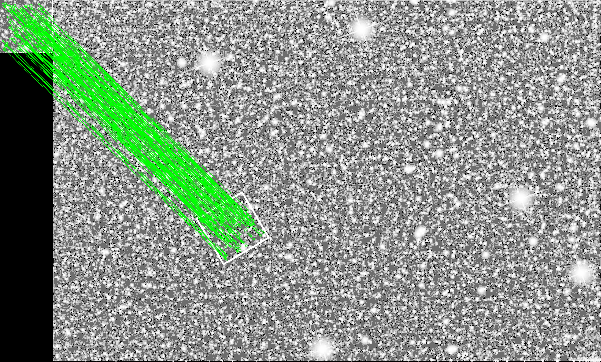

# Template Matcher

In the project, we are locating the defining area as scale and rotation invariant in the map image and return the coordinates of the matched location.

## Table of Contents
- [Template Matcher](#template-matcher)
  - [Table of Contents](#table-of-contents)
  - [Prerequisites](#prerequisites)
  - [Help](#help)
  - [Examples](#examples)
    - [1. Template matching example](#1-template-matching-example)
    - [2. Rotation invariant template matching example](#2-rotation-invariant-template-matching-example)
  - [Referances](#referances)

## Prerequisites

```bash
python 3.7.9
opencv 3.4.2
numpy 1.19.2
matplotlib 3.3.2
```

## Help

```bash 
python template_matcher.py -h

optional arguments:
  -h, --help           show this help message and exit
  --template TEMPLATE  The image to be used as template
  --map MAP            The image to be searched in
  --show               Shows result image
  --save-dir SAVE_DIR  Directory in which you desire to save the result image
```

## Examples

### 1. Template matching example

```bash
python template_matcher.py --template 'Small_area.png' --map 'StarMap.png' --show
```
**Template:**
<p align="left">
<br>
</p>

**Map:**
<p align="left">
<br>
</p>

**Result:**

<p align="left">
<br>
</p>

**Coordinates:**
```bash
[[[854.99304 149.9988 ]]
 [[855.      262.988  ]]
 [[968.0045  263.00714]]
 [[968.01587 149.98811]]]
```

### 2. Rotation invariant template matching example

```bash
python template_matcher.py --template 'Small_area_rotated.png' --map 'StarMap.png' --show
```
**Template:**
<p align="left">
<br>
</p>

**Map:**
<p align="left">
<br>
</p>

**Result:**

<p align="left">
<br>
</p>

**Coordinates:**
```bash
[[[420.5984  639.69196]]
 [[498.93964 771.2211 ]]
 [[630.31586 693.02856]]
 [[552.31104 561.55725]]]
```


## Referances

1. [Scale-Invariant Feature Transform](https://opencv-python-tutroals.readthedocs.io/en/latest/py_tutorials/py_feature2d/py_sift_intro/py_sift_intro.html)

2. [Feature Matching + Homography to find Objects
](https://opencv-python-tutroals.readthedocs.io/en/latest/py_tutorials/py_feature2d/py_feature_homography/py_feature_homography.html)

3. [Template Matching](https://docs.opencv.org/master/d4/dc6/tutorial_py_template_matching.html)

4. [Histogram Equalization](https://docs.opencv.org/master/d5/daf/tutorial_py_histogram_equalization.html)